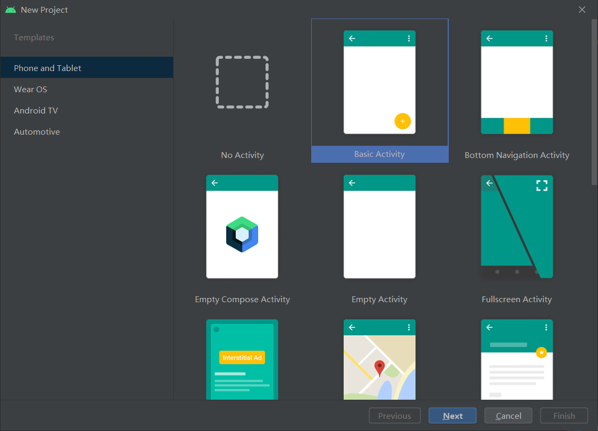
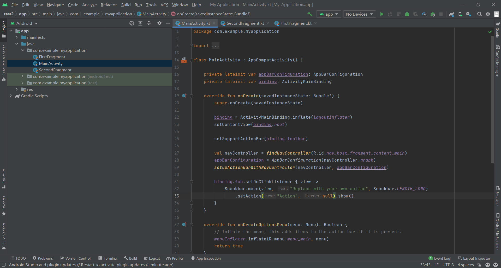
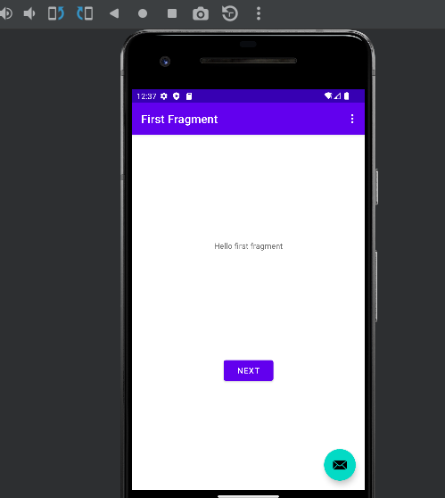
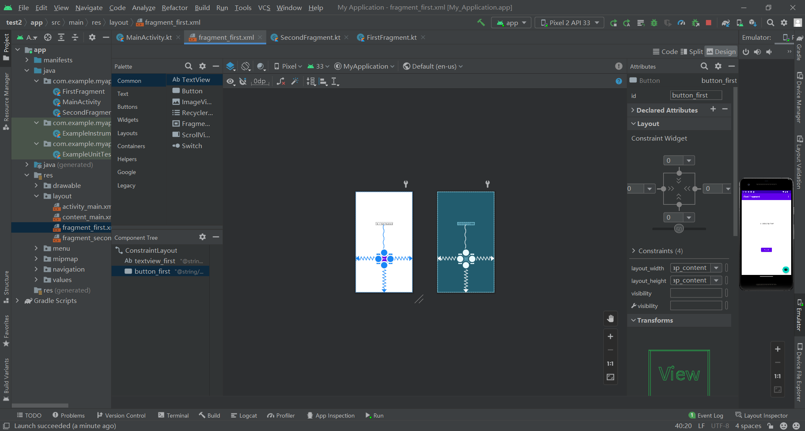
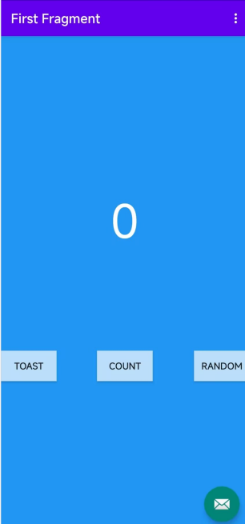

# 新建一个basic activity



# 建立完毕



# 初次运行效果





# 设置随机数

```kotlin
val showCountTextView = view.findViewById<TextView>(R.id.textview_first)

    // Get the value of the text view.
    val countString = showCountTextView.text.toString()

    // Convert value to a number and increment it
    var count = countString.toInt()
    val random = java.util.Random()
    count = count + random.nextInt(999);  //拿一个随机数
    showCountTextView.text = count.toString();
```

# 计数加1

```kotlin
val count = args.myArg
     val countText = getString(R.string.random_heading)
     view.findViewById<TextView>(R.id.textview_header).text = countText.substring(0,countText.length-2) + count.toString();
     val random = java.util.Random()
     var randomNumber = 0
     if (count > 0) {
         randomNumber = random.nextInt(count + 1)
     }
     view.findViewById<TextView>(R.id.textview_random).text = randomNumber.toString()
```

# 最后结果：




