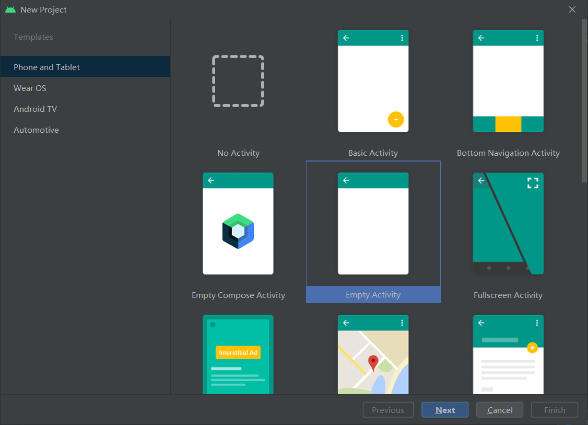
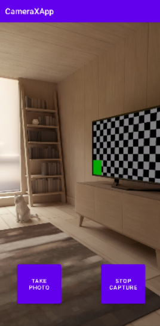

# 创建一个empty activity



# 添加依赖：


```kotlin
dependencies {
  def camerax_version = "1.1.0-beta01"
  implementation "androidx.camera:camera-core:${camerax_version}"
  implementation "androidx.camera:camera-camera2:${camerax_version}"
  implementation "androidx.camera:camera-lifecycle:${camerax_version}"
  implementation "androidx.camera:camera-video:${camerax_version}"
  implementation "androidx.camera:camera-view:${camerax_version}"
  implementation "androidx.camera:camera-extensions:${camerax_version}"
}
```

# 权限申请

```kotlin
 <uses-permission android:name="android.permission.CAMERA" />
 <uses-permission android:name="android.permission.RECORD_AUDIO" />
 <uses-permission android:name="android.permission.WRITE_EXTERNAL_STORAGE"

```

```kotlin
private fun allPermissionsGranted() = REQUIRED_PERMISSIONS.all {
    ContextCompat.checkSelfPermission(
        baseContext, it
    ) == PackageManager.PERMISSION_GRANTED
}
```

# 运行结果：

