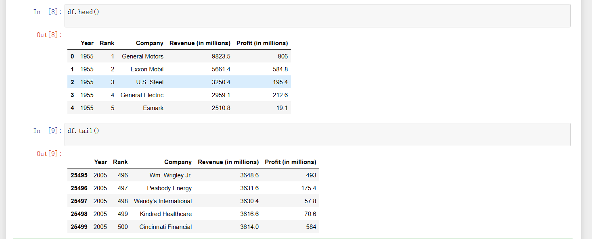

## 打开jupyter notebook：

## 上传csv

## 导入头文件和csv文件

## 查询数据集

对数据属性列进行重命名，以便在后续访问

检查数据条目是否加载完整。

其他属性列都正常，但是对于profit属性，期望的结果是float类型，因此其可能包含非数字的值，利用正则表达式进行检查。

使用直方图显示一下按照年份的分布情况。

## 使用matplotlib进行绘图

看看收入曲线

对数据结果进行标准差处理。

