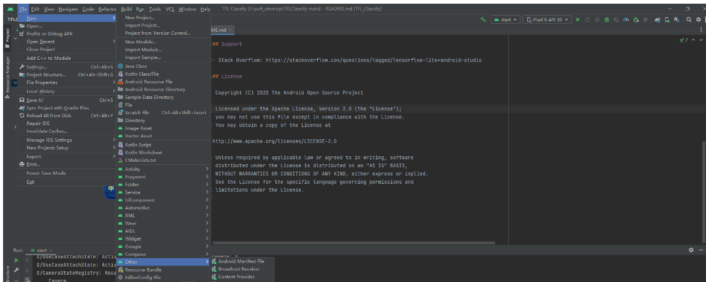

## 基于TensorFlow Lite实现的Android花卉识别应用

### 在Android设备上使用TensorFlow Lite运行图像识别模型，具体包括：

- 使用TensorFlow Lite Model Maker训练自定义的图像分类器

- 利用Android Studio导入训练后的模型，并结合CameraX使用

- 利用手机GPU加速模型运行

  ## 向应用中添加TensorFlow Lite




## 检查代码中的TODO项

## 添加代码重新运行APP

定位“start”模块**MainActivity.kt**文件的TODO 1，添加初始化训练模型的代码

```kotlin
private class ImageAnalyzer(ctx: Context, private val listener: RecognitionListener) :
        ImageAnalysis.Analyzer {

  ...
  // TODO 1: Add class variable TensorFlow Lite Model
  private val flowerModel = FlowerModel.newInstance(ctx)

  ...
}
123456789
```

在CameraX的analyze方法内部，需要将摄像头的输入`ImageProxy`转化为`Bitmap`对象，并进一步转化为`TensorImage` 对象

```kotlin
override fun analyze(imageProxy: ImageProxy) {
  ...
  // TODO 2: Convert Image to Bitmap then to TensorImage
  val tfImage = TensorImage.fromBitmap(toBitmap(imageProxy))
  ...
}
123456
```

对图像进行处理并生成结果，主要包含下述操作：

- 按照属性`score`对识别结果按照概率从高到低排序
- 列出最高k种可能的结果，k的结果由常量`MAX_RESULT_DISPLAY`定义

```kotlin
override fun analyze(imageProxy: ImageProxy) {
  ...
  // TODO 3: Process the image using the trained model, sort and pick out the top results
  val outputs = flowerModel.process(tfImage)
      .probabilityAsCategoryList.apply {
          sortByDescending { it.score } // Sort with highest confidence first
      }.take(MAX_RESULT_DISPLAY) // take the top results

  ...
}
```

将识别的结果加入数据对象`Recognition` 中，包含`label`和`score`两个元素。后续将用于`RecyclerView`的数据显示

```kotlin
override fun analyze(imageProxy: ImageProxy) {
  ...
  // TODO 4: Converting the top probability items into a list of recognitions
  for (output in outputs) {
      items.add(Recognition(output.label, output.score))
  }
  ...
}
12345678
```

将原先用于虚拟显示识别结果的代码注释掉或者删除

```kotlin
// START - Placeholder code at the start of the codelab. Comment this block of code out.
for (i in 0..MAX_RESULT_DISPLAY-1){
    items.add(Recognition("Fake label $i", Random.nextFloat()))
}
// END - Placeholder code at the start of the codelab. Comment this block of code out.
12345
```

以物理设备重新运行start模块