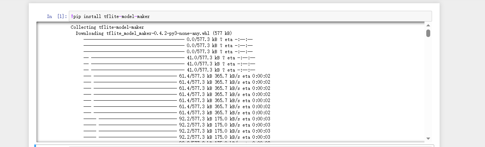
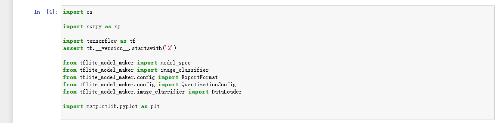
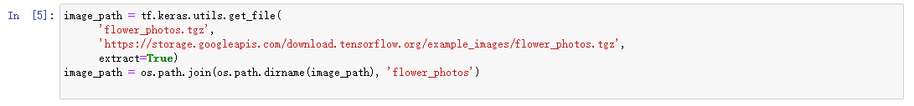
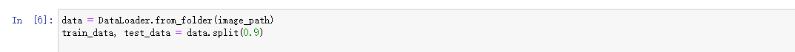
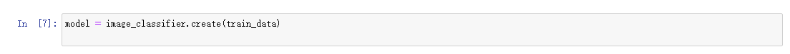
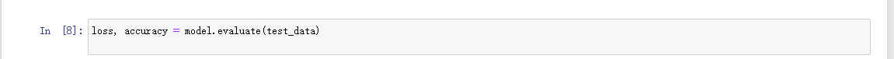
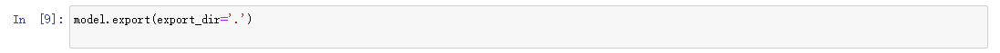

# 使用TensorFlow Lite Model Maker生成图像分类模型

## 预备工作

首先安装程序运行必备的一些库。

## 导入库

# 模型训练

## 获取数据

本实验先从较小的数据集开始训练，当然越多的数据，模型精度更高。

## 运行示例

第一步：加载数据集，并将数据集分为训练数据和测试数据。

第二步：训练Tensorflow模型

第三步：评估模型

第四步，导出Tensorflow Lite模型